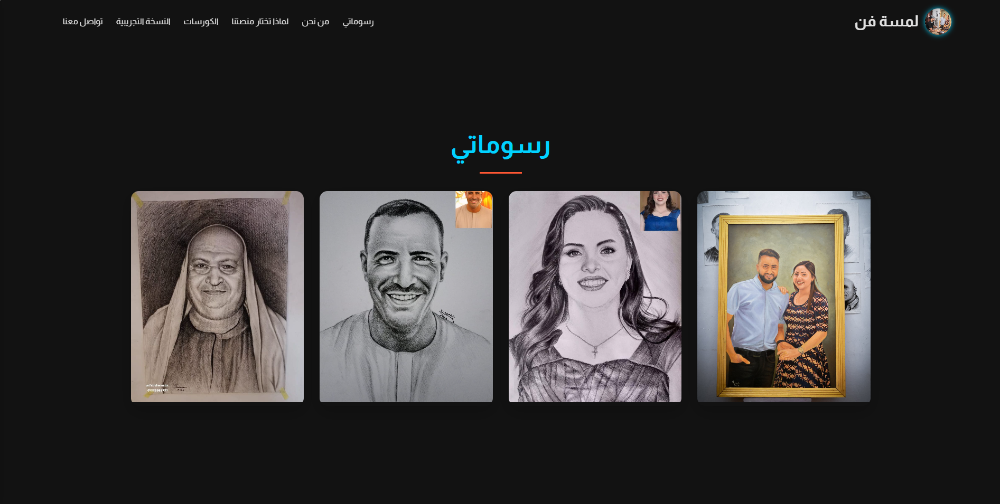

# 🎨 لمسة فن | Lamset Fan  

منصة تعليمية أونلاين خاصة بدروس **الرسم** 🎨✏️  
المنصة معمولة بالكامل باستخدام **HTML, CSS, JavaScript**.  

🔗 [جرّب المشروع من هنا](https://shnshart.vercel.app)  

---

## 📸 صورة من المشروع

---

## ✨ مميزات المشروع:
- 🖼️ **واجهة رئيسية بسيطة وجذابة**:  
  نافبار فيه لوجو "لمسة فن" + روابط مهمة (رسوماتي، من نحن، تواصل معنا، الكورسات، النسخة التجريبية).  

- 📚 **قسم الكورسات**:  
  - 4 كورسات معروضين في شكل Cards.  
  - كل كارد فيه صورة + اسم الكورس + زرار دخول الكورس.  

- 🔑 **نظام تسجيل الدخول للكورس**:  
  - لما تدوس على الكورس يطلب منك (الاسم + كلمة السر).  
  - لو البيانات صحيحة، يفتح الكورس باسم الطالب + زرار لتسجيل الخروج.  
  - الفيديوهات الخاصة بالكورس تظهر للطالب.  

- 🎥 **قسم النسخة التجريبية**:  
  أي حد يقدر يشوف فيديوهات مجانية قبل الاشتراك في الكورس.  

- 📱 **تصميم متجاوب**:  
  بيشتغل على الموبايل والتابلت والكمبيوتر.  

- 👣 **فوتر بسيط**:  
  فيه لينك الفيسبوك + حقوق الموقع.  

---

## 🛠️ التقنيات المستخدمة:
- HTML5  
- CSS3  
- JavaScript  
